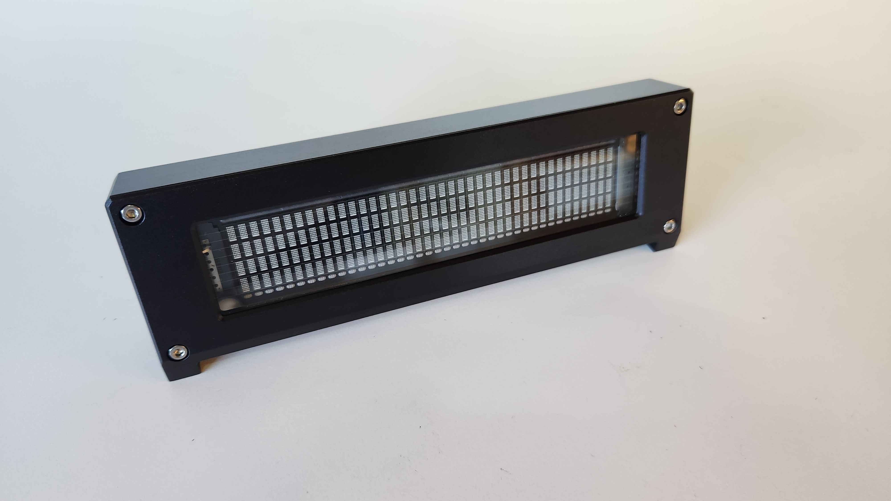

# 4x40 Bench LCD with USB-C interface for LCD Smartie
This is a 40x4 character LCD controller and a machined aluminum case with an USB-C interface based around a PIC18F2550
It's intended to work with LCDSmartie

Based on the original work by caesar on the LCDSmartie forums: https://lcdsmartie.org/forums/viewtopic.php?p=22548

Im providing the following:

1- 3D model in solidworks, STEP files and blueprints for machining the case

2- PCB for the interface with USB-C horizontal, USB-C vertical connectors and 0.1in header

3- Source code for the PIC18F2550 with brightness and contrast control. The project is built for MPLAB X IDE v6.20 with the C18 compiler 

Everything should work with LCD and VFD displays.

